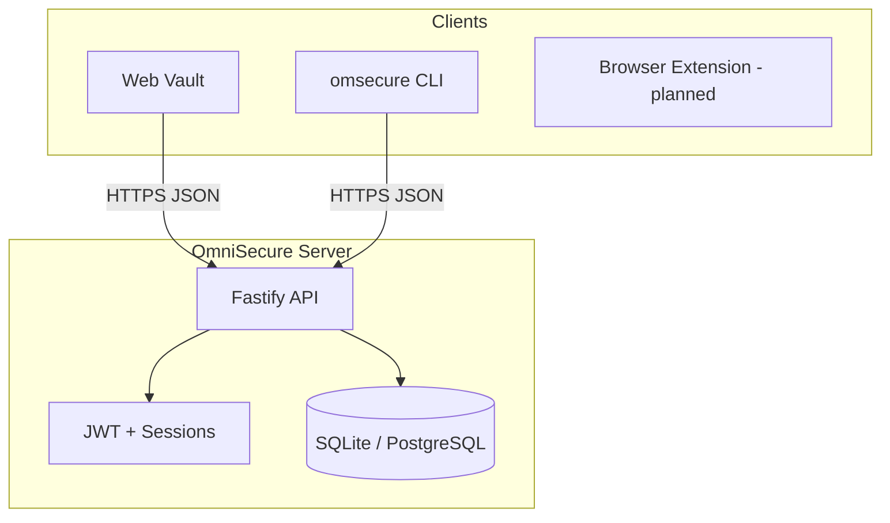

# Architecture

## Overview

OmniSecure follows Bitwarden's zero-knowledge architecture: clients encrypt/decrypt locally; the server is a sync and authorization layer over ciphertext.

## Cryptography

| Layer | Algorithm | Notes |
|-------|-----------|-------|
| Master password → stretched key | PBKDF2-SHA256, 600k iterations | Salt = SHA256(email) |
| Vault key wrap | AES-256-GCM | Stretched key encrypts symmetric vault key |
| Item encryption | AES-256-GCM | Symmetric vault key encrypts cipher JSON |
| Org sharing keys | RSA-2048 OAEP | Private key encrypted with vault key |
| Send links | Random 256-bit key | Payload encrypted client-side |
| API tokens | SHA-256 hash stored | Plain token shown once at creation |

### Client implementations

- **Node (server registration, CLI):** `packages/crypto/src/vault-crypto.ts` — `node:crypto`
- **Browser (web vault):** `packages/crypto/src/browser-crypto.ts` — Web Crypto API

Both use identical KDF parameters and AES-GCM wire format for interoperability.

## API surface

| Prefix | Responsibility |
|--------|----------------|
| `/api/auth` | Register, login, profile |
| `/api/vault` | Sync, ciphers, folders |
| `/api/organizations` | Orgs, collections, audit events |
| `/api/send` | Secure sharing links |
| `/api/secrets` | Projects, secrets, service accounts |
| `/api/emergency-access` | Trusted contact access |
| `/tools/*` | Public generators |
| `/health` | Liveness |

## Data model

See `packages/server/src/db/schema.ts` for tables:

- `users` — account metadata + encrypted key material (not master password)
- `ciphers` — encrypted vault items
- `organizations` / `organization_users` / `collections`
- `sends` — encrypted share payloads
- `secret_projects` / `secrets` / `service_accounts`
- `audit_events` — org activity log

## Deployment modes

1. **Development:** SQLite file, single Node process, Vite dev server
2. **Self-host:** Docker Compose — API container + optional Postgres
3. **Cloud (planned):** Managed OmniSecure for OmniTender merchants

## Security considerations

- Change `JWT_SECRET` in production
- Use TLS termination (nginx/Caddy) in front of API
- Rate-limit auth endpoints
- Third-party security audit recommended before production merchant use
- Master password recovery is impossible by design (zero-knowledge)

## Ecosystem integration

| Repo | Integration |
|------|-------------|
| OmniAuth | TOTP codes for OmniSecure account 2FA |
| OmniTender | Policy docs, staff onboarding |
| omnitender-web | Marketing page for OmniSecure (planned) |
| AgentCorps | CI secrets via service accounts + CLI |
